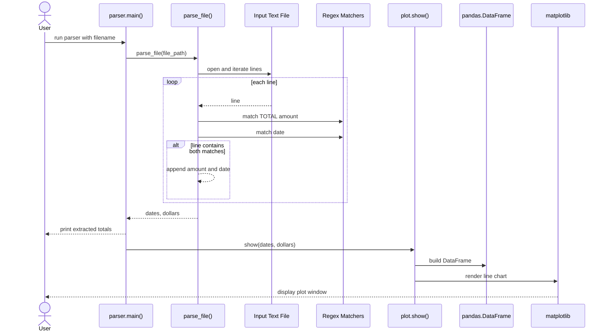
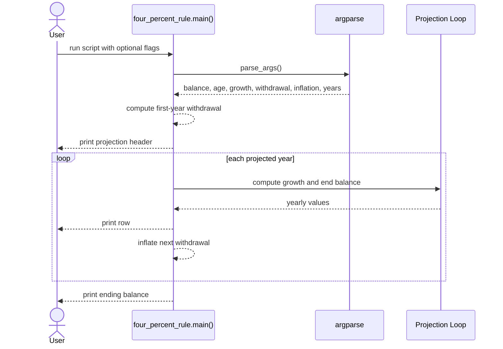
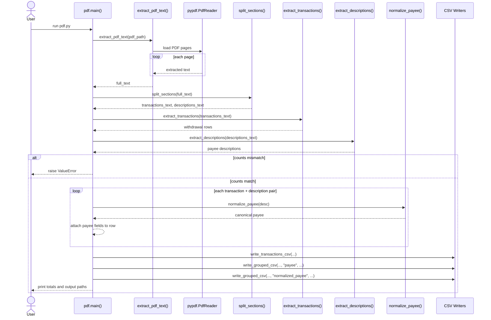

# Sequence Diagrams

These Mermaid diagrams describe the current execution flow of the Python scripts in `fin/`.

## `fin/parser.py`

```mermaid
sequenceDiagram
    actor User
    participant Main as parser.main()
    participant Parser as parse_file()
    participant File as Input Text File
    participant Regex as Regex Matchers
    participant Plot as plot.show()
    participant Pandas as pandas.DataFrame
    participant MPL as matplotlib

    User->>Main: run parser with filename
    Main->>Parser: parse_file(file_path)
    Parser->>File: open and iterate lines
    loop each line
        File-->>Parser: line
        Parser->>Regex: match TOTAL amount
        Parser->>Regex: match date
        alt line contains both matches
            Parser-->>Parser: append amount and date
        end
    end
    Parser-->>Main: dates, dollars
    Main-->>User: print extracted totals
    Main->>Plot: show(dates, dollars)
    Plot->>Pandas: build DataFrame
    Plot->>MPL: render line chart
    MPL-->>User: display plot window
```

## `fin/four_percent_rule.py`

```mermaid
sequenceDiagram
    actor User
    participant Main as four_percent_rule.main()
    participant Args as argparse
    participant Calc as Projection Loop

    User->>Main: run script with optional flags
    Main->>Args: parse_args()
    Args-->>Main: balance, age, growth, withdrawal, inflation, years
    Main-->>Main: compute first-year withdrawal
    Main-->>User: print projection header
    loop each projected year
        Main->>Calc: compute growth and end balance
        Calc-->>Main: yearly values
        Main-->>User: print row
        Main-->>Main: inflate next withdrawal
    end
    Main-->>User: print ending balance
```

## `fin/pdf.py`

```mermaid
sequenceDiagram
    actor User
    participant Main as pdf.main()
    participant PDF as extract_pdf_text()
    participant Reader as pypdf.PdfReader
    participant Split as split_sections()
    participant Txns as extract_transactions()
    participant Desc as extract_descriptions()
    participant Norm as normalize_payee()
    participant CSV as CSV Writers

    User->>Main: run pdf.py
    Main->>PDF: extract_pdf_text(pdf_path)
    PDF->>Reader: load PDF pages
    loop each page
        Reader-->>PDF: extracted text
    end
    PDF-->>Main: full_text
    Main->>Split: split_sections(full_text)
    Split-->>Main: transactions_text, descriptions_text
    Main->>Txns: extract_transactions(transactions_text)
    Txns-->>Main: withdrawal rows
    Main->>Desc: extract_descriptions(descriptions_text)
    Desc-->>Main: payee descriptions
    alt counts mismatch
        Main-->>User: raise ValueError
    else counts match
        loop each transaction + description pair
            Main->>Norm: normalize_payee(desc)
            Norm-->>Main: canonical payee
            Main-->>Main: attach payee fields to row
        end
        Main->>CSV: write_transactions_csv(...)
        Main->>CSV: write_grouped_csv(..., "payee", ...)
        Main->>CSV: write_grouped_csv(..., "normalized_payee", ...)
        Main-->>User: print totals and output paths
    end
```
